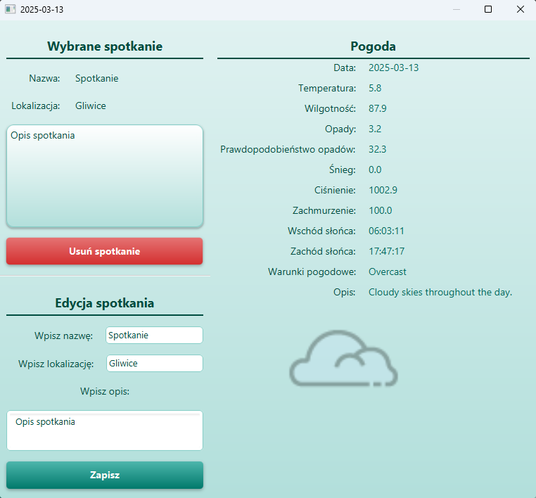

# Weather-Calendar
Simple JavaFX application for university that allows users to schedule meetings and check the weather forecast for the selected day.

## Objectives
- the ability to add a meeting on a specific day using a calendar mechanism,
- displaying weather forecasts and meeting information upon clicking a specific day in the calendar,
- automatic updates to the user interface when data changes.
- informing the user about any errors or successes of performed operations, exception handling
- the application should fetch the latest weather data from an external API,
- the application should store meeting data in binary files, and in the future, also in JSON files,
- separation of the user interface logic from the application logic,
- develop of CSS styles to create a clear graphical user interface.

## Technologies
- language: [Java 23](https://docs.oracle.com/en/java/javase/23/)
- framework: [JavaFX 23](https://openjfx.io/)
- build system: [Maven 3.8.0](https://maven.apache.org/)
- GUI Design: [SceneBuilder](https://gluonhq.com/products/scene-builder/)
- external API: [Visual Crossing Weather API](https://www.visualcrossing.com/weather-api)
- Serialization, deserialization with API: [Gson 2.11.0](https://github.com/google/gson)

## Graphical User Interface

## Authors
- [Tomasz Wojtasek (Zogir01)](https://github.com/Zogir01)
- [Paweł Kurek (PANP4W3L)](https://github.com/PANP4W3L)
